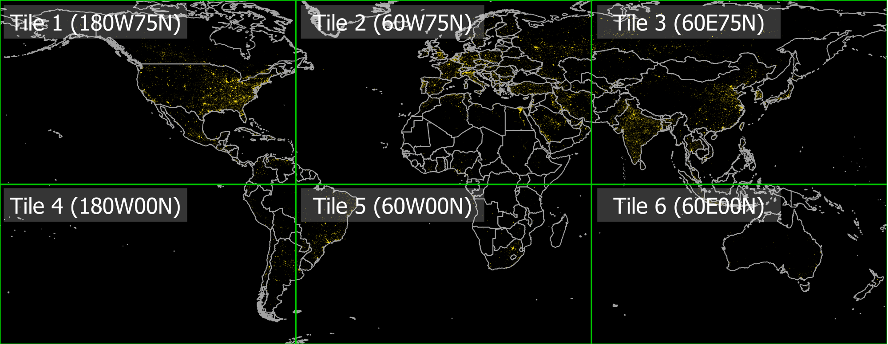

```@meta
CurrentModule = NighttimeLights
```

# NighttimeLights

Documentation for [NighttimeLights](https://github.com/JuliaPlanet/NighttimeLights.jl).

National Oceanic and Atmospheric Administration (NOAA) releases nighttime lights images produced using the Visible Infrared Imaging Radiometer Suite (VIIRS) since April 2012. Nighttime lights data had emerged as a useful tool to measure economic activity. Many researchers have established a correlation between prosperity and the brightness of a region. In many situations, nighttime lights generates measures with accuracy, latency and geographical resolution that are superior to conventional methods of measurement, such as GDP.

Using nighttime lights for economic analysis require cleaning of data and aggregating measurements of pixels over regions of interest. This is the first open source implementation of these procedures for nighttime lights.

While there are packages to do image processing in Julia, the assumptions about the sensor producing the data, such as in Images.jl, make it incompatible with nighttime lights data. We built the package from scratch without making any assumptions about the sensor. Functions in the package take regular float 3D arrays as input, which makes it possible to extend the package to data from any sensor and not just VIIRS nighttime lights. 


This package was a foundation for a research paper, "But clouds got in my way: bias and bias correction of VIIRS nighttime lights data in the presence of clouds" by Ayush Patnaik, Ajay Shah, Anshul Tayal, Susan Thomas. The paper diagnoses a source of bias in the data and responds to this problem with a bias correction scheme. Along with other mainstream methods of data cleaning, this method is also implemented in the package. The details are in the paper which can be accessed from its [landing page](https://xkdr.org/releases/PatnaikShahTayalThomas_2021_bias_correction_nighttime_lights.html) 

# Installation

This Julia package uses R functions. The package requires a functioning [RCall](https://github.com/JuliaInterop/RCall.jl) with forecast package installed. 
Once this is done, you can install the Julia package. 
```
pkg> add https://github.com/JuliaPlanet/NighttimeLights.jl
```

# Downloading data

NOAA nighttime lights data is hosted by [Payne Institute](https://payneinstitute.mines.edu/eog/nighttime-lights/) at the [Earth Observation Group](https://eogdata.mines.edu/products/vnl/). 

The data is stored in tif files. These are opened as 2D matrices and for each pixel, there is a floating-point value representing the amount of light. Monthly composites are produced by taking the average of measurements produced on days free of clouds. The number of cloud-free obersation used to generate those are also in stored in tif files. 

There two types of annual images, those produced using daily images and those produced using monthly composites. 

The tif files covering the entire planet are large. NOAA also provides tiled data. The planet is divided into 6 tiles in the following manner: 



If your region of interest is covered in one tile, then you may not need to download the full image of the planet. 

# Getting help 

To get enquire about the Julia package, you can join the Julia community on [slack](https://julialang.org/slack/) and post questions on the nighttime-lights channel. You can also email one of the authors of the package, [Ayush Patnaik](mailto:ayushpatnaik@gmail.com)

For questions regarding nighttime lights data, you can email [Kim Baugh](mailto:Kim.Baugh@noaa.gov)