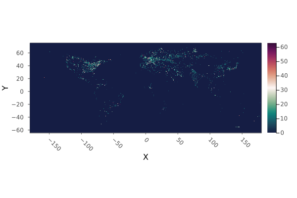
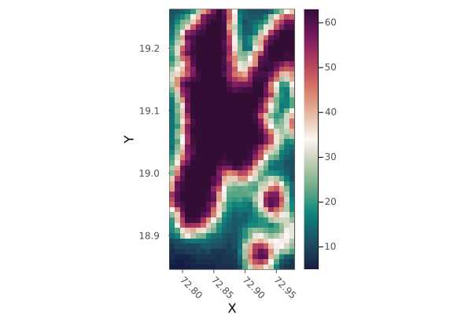
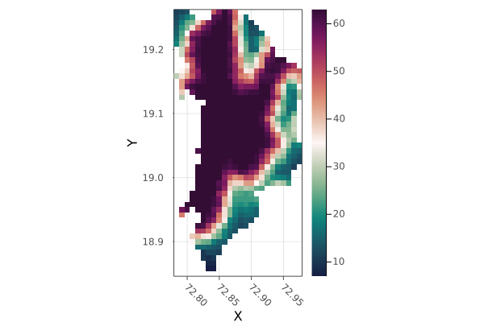

```julia
using Plots
plot(raster)
```


```julia
mumbaibox_radiance = crop(raster; to = mumbai_map.geometry)
plot(mumbaibox_radiance)
```

```julia
mumbai_radiance = mask(mumbaibox_radiance, with = mumbai_map.geometry)
plot(mumbai_radiance)
```

