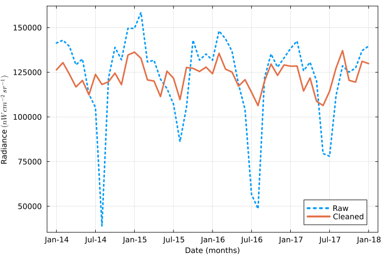

# Summary

A remarkable development in alternative data is the use of satellites that measure nighttime light radiance. From the early 1990s, Nightlights (NL) has been used to measure economic activity. NL correlates well with standard measures of growth and development [@doll2006mapping], which allows measures of economic growth where existing measures are either unreliable or lack the continuity and/or resolution of constant satellite observation. 

Raw monthly NL files are not analysis-ready. They contain missing observations, negative values, outliers, background noise, and cloud-related attenuation [@uprety2019calibration; @rs9080798; @MaEtal2014_responsesNppViirsNightlightSocioeconomicChina]. As a result, every research team must individually implement preprocessing, often with project-specific scripts. This creates entry barriers and weakens comparability and reproducibility across studies.

# Statement of need

`NighttimeLights.jl` is a Julia package for cleaning and bias-correcting monthly nighttime lights from the Visible Infrared Imaging Radiometer Suite (VIIRS). It provides a transparent and reproducible workflow that implements established methods from the applied literature, including cloud-related attenuation correction [@patnaik2021but; @pearson2002outliers; @guptaEtal2017_analysisViirsDerivedNightlightOverIndia].

The package addresses a practical gap: many papers using NL data rely on individual preprocessing pipelines, making it difficult to reproduce findings or compare outcomes across studies. By consolidating key cleaning steps into one standard package, `NighttimeLights.jl` reduces duplicated effort and standardizes core data preparation.

# State of the field

There are two dominant nighttime-lights products used in applied work: annual DMSP-OLS composites (1992-2013) and monthly VIIRS composites (2012-present). VIIRS has finer temporal and spatial resolution and is now the primary data source for contemporary analysis.

Most empirical NL workflows use combinations of missing-value recoding, outlier removal, and cloud-aware filtering, but implementation details vary across projects. This heterogeneity limits comparability. `NighttimeLights.jl` standardizes these operations while retaining modular control for users.

Several software tools already serve the nighttime-lights community, but they address a different part of the workflow. `BlackMarbleR` [@marty2024blackmarbler] and its Python counterpart `BlackMarblePy` [@marty2024blackmarblepy] download NASA's Black Marble product and compute zonal statistics for administrative regions; `Rnightlights` [@njoku2019rnightlights] does the same for the NOAA DMSP-OLS and VIIRS composites, though is currently unmaintained; and the VIIRS collections in Google Earth Engine [@gorelick2017gee] provide server-side access and aggregation. General-purpose raster frameworks such as `GeoWombat` [@graesser2026geowombat] in Python and `Rasters.jl` in Julia supply the data-cube mechanics (reading, reprojection, alignment, and chunked computation) and, in the case of `GeoWombat`, radiometric corrections for daytime optical sensors, but they carry no nighttime-lights-specific cleaning. The nighttime-lights tools focus on acquisition and spatial aggregation, and the Black Marble product applies sensor, terrain, and atmospheric corrections upstream at the pixel level. None of them implement a configurable statistical cleaning pipeline for the raw NOAA monthly composites, and none correct the cloud-cover attenuation bias that dominates monthly series in monsoonal regions. Contributing these routines to the existing packages would mean maintaining the same methods across multiple language ecosystems while simultaneously overreaching their remit. Providing them as a standalone Julia package, with the cleaning pipeline itself as the unit of reuse, keeps the methods in one place and keeps a cleaned panel reproducible from a single package version.

# Software design

`NighttimeLights.jl` is implemented in Julia and built on `Rasters.jl` for geospatial data handling. Data is represented as raster data cubes with dimensions $(x,y,t)$, and cleaning is organized as composable functions. Core functions include:

- Missing-data handling: `na_recode`, `na_interp_linear`
- Negative-value handling: `replace_negative`
- Outlier treatment: `outlier_hampel`, `outlier_variance`
- Background-noise filtering: `bgnoise_PSTT2021`
- Cloud-bias correction: `bias_PSTT2021`

These are wrapped into high-level pipelines such as `PSTT2021()`, `PSTT2021_conventional()`, and `clean_complete()`. This design supports both  method-level customization and standardized, time-consistent cleaning pipelines.

Several design choices shaped the package. Primarily, cleaning is exposed as a set of small composable functions rather than a single opaque routine. This enlarges the API surface and requires the user to respect an ordering between steps, but it allows for customization and lets each stage be run, inspected, and switched out independently, which is what makes the package usable for methodological work while still allowing reproducability. Secondly, the package is written in Julia because the core operations are per-pixel time-series computations over large pixel counts. Hampel filters, LOWESS fits, linear interpolation, etc. are awkward to express as fast vectorised array code and would otherwise require C extensions, if not for Julia's loop performance. Finally, existing best-practices cleaning and cloud-bias-corrected cleaning are kept as separately named and dated pipelines (`PSTT2021_conventional` and `PSTT2021`) so that results remain reproducable as well as directly comparable to the large body of prior work that does not correct for cloud cover.

# Research impact statement

The package has been used as infrastructure for empirical work involving inference using VIIRS nighttime lights. Its main impact is methodological consistency: researchers can move from raw files to analysis-ready panels using explicit, shared preprocessing steps.

Because each stage is exposed as a public function, `NighttimeLights.jl` also serves as a platform for methodological development. Users can inspect intermediate outputs, compare alternative cleaning choices, and contribute new preprocessing methods while preserving reproducible workflows.

The cloud-bias correction implemented here was developed and validated in @patnaik2021but, and `NighttimeLights.jl` is the reference implementation of that method. The package has been used to build analysis-ready VIIRS panels for applied economic work, including a study of wartime economic activity in Ukraine [@hande2025shedding] and an analysis of regional economic patterns across Java, Indonesia [@aviliani2026lights]. It also underpins the public India Built and Lit dataset, which distributes cleaned nighttime-lights panels for India [@xkdr2026indiabuiltlit]. Reproducibility is supported concretely: a Mumbai example cube ships with the package and is loaded with `load_example()`, every pipeline stage is a documented public function, the package is registered in the Julia General registry, and the results quoted in this paper were produced with the pinned versions listed under Computational details and can be regenerated with a linked Google colab notebook.

# Computational details

Results referenced in this manuscript were generated with Julia 1.12.6 and `NighttimeLights.jl` 0.9.1. Julia is available at <https://julialang.org/> and the package is available at <https://github.com/xKDR/NighttimeLights.jl>.

Installation from the General registry:

```
] add NighttimeLights
```

# Usage example



\autoref{fig:exampledata} shows the aggregate radiance of raw and cleaned NL of Mumbai. The notebook that produced this data can be found on Google colab [here](https://github.com/xKDR/NighttimeLights.jl/blob/joss-submission/submission/SRC/replication.ipynb).
On the $y$ axis, the lines show the aggregate raw and cleaned NL measured in $nW\ cm^{-2}\ sr^{-1}$. The $x$ axis shows time measured in months from January 2014 to January 2018. Note the bias during the monsoon months (e.g. July), which is significantly reduced in the cleaned data.

| Statistic       |    Raw | Cleaned |
| --------------- | -----: | ------: |
| Minimum         |  -0.14 |     0.0 |
| Mean            |    9.1 |     9.1 |
| Median          |    3.2 |     0.0 |
| 99th percentile |   54.0 |    59.0 |
| Maximum         | 4300.0 |   1700.0|

: Effect of cleaning on nighttime lights for Mumbai.

The table shows some summary statistics for raw and cleaned NL for Mumbai. Note the absence of negative values in the datacube. The maximum value after is also lower, as some outlier values have been removed. Half the values in the raw data cube are below 4, these can be attributed to background noise. All these measurements have been zeroed. The increase in the $99^{th}$ percentile value is due to the bias correction procedure.


# AI usage disclosure

No generative AI tools were used in the development of the software package, or the written text. AI assistance was used in formatting tables in the markdown document.

# Acknowledgements

We acknowledge contributions from Anshul Tayal, Siddhant Chauddhary, and Hrishikesh Saikia to the codebase and package design. This work received financial support from the MIT Julia Lab.

# References
